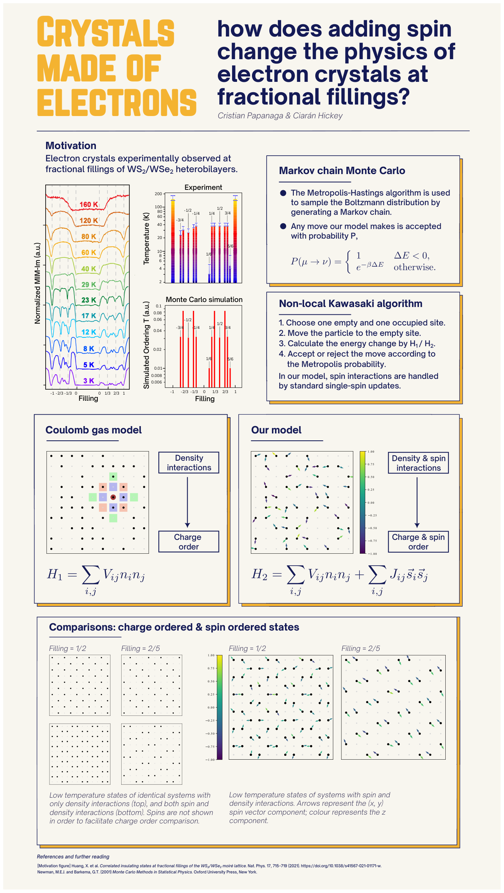

# wigner

**Crystals made of electrons: how does adding spin change the physics of electron crystals at fractional fillings?**



`wigner` is a Cython-accelerated Monte Carlo package for simulating **electron crystals** (Wigner crystals) on a square lattice, including both **density (Coulomb gas)** and **spin** interactions. It is motivated by the experimental observation of correlated insulating states at fractional fillings of WS₂/WSe₂ moiré heterobilayers (Huang et al., 2021), and is used to study how the addition of spin degrees of freedom modifies the charge and spin ordering of electron crystals at fractional fillings.

## Physics background

At low densities, electrons on a lattice can crystallise into ordered structures known as *Wigner crystals*. In moiré materials such as WS₂/WSe₂ heterobilayers, such electron crystals have been observed at fractional fillings of the moiré lattice. A key open question is how the *spin* of the electrons affects the physics of these crystals.

This package models the system as a lattice gas of electrons with classical Heisenberg spins, interacting through:

- **Density interactions** (a Coulomb-gas-like term) that drive *charge order*.
- **Spin exchange interactions** that drive *spin order*.

By tuning the filling fraction and the relative strengths of the density and spin couplings, the model reproduces the charge-ordered states observed experimentally and reveals how spin ordering coexists with (and modifies) the charge order.

## The model

The Hamiltonian is

$$
H = \sum_{\langle i,j\rangle} V_{ij}\, n_i n_j + \sum_{\langle i,j\rangle} J_{ij}\, \mathbf{S}_i \cdot \mathbf{S}_j,
$$

where:

- $n_i \in \{0, 1\}$ is the occupancy of site $i$ (electron present or not),
- $\mathbf{S}_i$ is a classical Heisenberg spin on an occupied site,
- $V_{ij}$ and $J_{ij}$ are the density and spin-exchange couplings between sites $i$ and $j$,
- the sums run over nearest, next-nearest, and third-nearest neighbours (up to 3rd neighbours are supported).

### Monte Carlo moves

The system is sampled with the **Metropolis–Hastings** algorithm, using two types of moves:

1. **Particle move (non-local Kawasaki algorithm):** an electron is moved from a randomly chosen occupied site to a randomly chosen empty site. The energy change is computed and the move is accepted with probability

   $$
   P = \min\!\left(1,\, e^{-\Delta E / T}\right).
   $$

2. **Single-spin update:** the spin of a randomly chosen electron is replaced by a new random direction on the sphere, and the move is accepted with the same Metropolis probability.

### Simulated annealing

To find low-temperature (ground-state) configurations, the lattice is slowly cooled from a high temperature through a user-supplied cooling schedule. Annealing helps prevent the Monte Carlo method from becoming stuck in local minima.

## Installation

The package is written in Cython and requires Python 3.11. It is managed with `uv`:

```bash
git clone https://github.com/CristianPapanaga/wigner.git
cd wigner
uv sync
```

This will install the dependencies and build the Cython extensions (`wigner` and `lattice_utilities`).

## Usage

### Running a simulation

A minimal simulation is shown in `src/testing.py`:

```python
import lattice_utilities as lat_utils
import numpy as np
import wigner

# Parameters
L = 8
n_sweeps = 5000

A = 1.0
B = np.exp(-np.sqrt(2))
C = np.exp(-2)
V = 1.0
J = 1.0

# Couplings for 1st, 2nd and 3rd nearest neighbours (4 neighbours each).
V_list = np.array([A, A, A, A, B, B, B, B, C, C, C, C], dtype=np.float64) * V
J_list = np.array([A, A, A, A, B, B, B, B, C, C, C, C], dtype=np.float64) * J

# Cooling schedule: from T = 0.2 down to T = 0 in steps of 0.0025.
schedule = np.arange(0.2, 0, -0.0025, dtype=np.float64)

# Generate a random lattice with 75% filling.
particle_lattice = lat_utils.generate_filled_square_lattice(L, filling=0.75)

# Run the simulated annealing simulation.
wigner.wigner_anneal(particle_lattice, 3, n_sweeps, V_list, J_list, schedule)
```

Key parameters of `wigner_anneal`:

| Argument | Description |
| --- | --- |
| `particle_lattice` | 1D array of length `L²`; `1` = occupied, `0` = empty. |
| `nth_neighbours` | Number of neighbour shells to include (max 3). |
| `n_sweeps` | Number of sweeps per scheduled temperature. |
| `V_list` | Density couplings, ordered by neighbour shell (4 per shell). |
| `J_list` | Spin-exchange couplings, ordered by neighbour shell (4 per shell). |
| `schedule` | Cooling schedule (list of temperatures). |
| `thermal_frac` | Fraction of sweeps used for thermalisation (default `0.1`). |
| `data_collection_interval` | Interval (in sweeps) at which data is collected (default `1`). |

### Analysing and visualising results

When the simulation finishes, you will be prompted to provide a folder name; the data is saved to `src/data/<folder>/`. The saved data includes the final particle lattice, the spin lattice, the energy array, and the simulation parameters.

To analyse and plot the results, run `src/data_analysis.py` (edit the `data_folder` variable to point at your data):

```bash
python src/data_analysis.py
```

This computes the specific heat and produces the following plots in `src/visualizations/`:

- **Energy (per site) annealing plot** — energy vs. temperature.
- **Specific heat plot** — specific heat vs. temperature.
- **Lattice** — the final charge configuration.
- **Lattice with spin vectors** — the final charge configuration with spin vectors (arrows show the in-plane spin component; colour shows the out-of-plane component).

## Project structure

```
wigner/
├── assets/
│   └── poster.png              # Project poster
├── src/
│   ├── wigner.pyx              # Main simulated-annealing Monte Carlo engine
│   ├── lattice_utilities.pyx   # Lattice generation and neighbour lookup
│   ├── data_utilities.py       # Data saving/loading, specific heat, plotting
│   ├── data_analysis.py        # Example analysis pipeline
│   ├── testing.py              # Example simulation
│   ├── data/                   # Simulation output data
│   └── visualizations/         # Generated plots
├── setup.py                    # Cython build configuration
└── pyproject.toml              # Project metadata and dependencies
```

## References and further reading

- Huang, X. et al. *Correlated insulating states at fractional fillings of the WS₂/WSe₂ moiré lattice.* Nat. Phys. **17**, 715–719 (2021). https://doi.org/10.1038/s41567-021-01171-w
- Newman, M.E.J. and Barkema, G.T. *Monte Carlo Methods in Statistical Physics.* Oxford University Press, New York (2001).